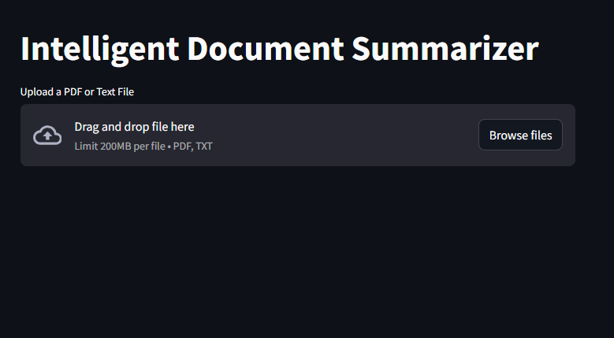

---

# **Intelligent Document Summarizer**

## **Overview**
This project is a Streamlit-based application that allows users to upload PDF or text files and generate concise summaries using **Hugging Face's BART** model. It leverages modern NLP techniques to extract, process, and summarize large documents, making it easier to derive insights from text-heavy content.

---

## **Features**
- Upload PDFs or text files for processing.
- Extract text from multi-page PDF documents.
- Generate concise summaries in **3–5 sentences** using pre-trained NLP models.
- User-friendly interface built with **Streamlit**.
- Works offline with Hugging Face models—no external API required.

---

## **Tech Stack**
- **Programming Language**: Python
- **Libraries and Frameworks**:
  - [Streamlit](https://streamlit.io/) for building the web interface.
  - [pdfplumber](https://github.com/jsvine/pdfplumber) for text extraction from PDFs.
  - [Hugging Face Transformers](https://huggingface.co/transformers/) for summarization using `facebook/bart-large-cnn`.

---

## **How It Works**
1. **File Upload**:
   - Users can upload a `.pdf` or `.txt` file via the app interface.
2. **Text Extraction**:
   - Extracts plain text from the uploaded file using `pdfplumber`.
3. **Summarization**:
   - The text is passed to a pre-trained summarization model (BART).
   - Generates a concise summary of the content.
4. **Output**:
   - Displays both the extracted text and the summary in the app.

---

## **Installation**

1. **Clone the Repository**:
   ```bash
   git clone https://github.com/vedantb99/intelligent-document-summarizer.git
   cd intelligent-document-summarizer
   ```

2. **Set Up the Environment**:
   Install the required libraries:
   ```bash
   pip install -r requirements.txt
   ```

   Example `requirements.txt`:
   ```
   streamlit
   pdfplumber
   transformers
   ```

3. **Run the Application**:
   ```bash
   streamlit run app.py
   ```

---

## **Demo**
### **Screenshots**:


- **File Upload**:
  

- **Generated Summary**:
  

---

## **Example Usage**
- **Input**: "Upload a 10-page PDF document discussing AI advancements."
- **Output**:
  - Summary: "This document outlines recent advancements in AI, focusing on NLP and generative models like GPT. Key applications include text summarization and conversational agents."

---

## **Future Improvements**
- Add support for multilingual summarization using **mBART**.
- Include **text-to-speech** for audio summaries.
- Deploy the app online using platforms like **Streamlit Cloud** or **Hugging Face Spaces**.

---

## **Contributing**
Contributions are welcome! Feel free to open issues or submit pull requests for enhancements or bug fixes.

---

## **License**
This project is licensed under the [MIT License](LICENSE).

---

## **Acknowledgments**
- Hugging Face for their amazing transformers library.
- Streamlit for making app development simple and intuitive.

---